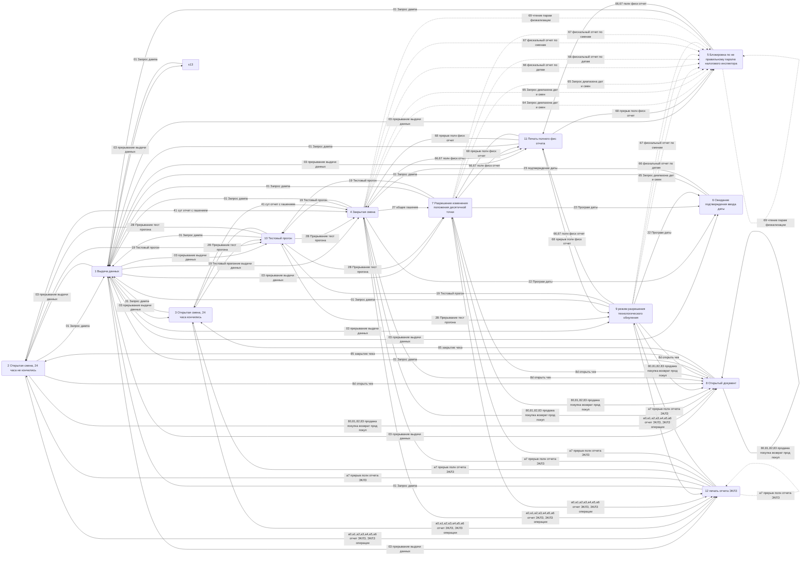

Элвес ФР-К Состояния
=====================
Версия документации 1.0, номер сборки 34, дата сборки 08.09.2008

Состояния

- 1 Выдача данных
- 2 Открытая смена, 24 часа не кончились
- 3 Открытая смена, 24 часа кончились
- 4 Закрытая смена
- 5 Блокировка по не правильному паролю налогового инспектора
- 6 Ожидание подтверждения ввода даты
- 7 Разрешение изменения положения десятичной точки
- 8 Открытый документ
- 8.1 Продажа
- 8.2 Покупка
- 8.3 Возврат продажи
- 8.4 Возврат покупки
- 9 режим разрешения технологического обнуления
- 10 Тестовый прогон
- 11 Печать полного фис отчета
- 12 печать отчета ЭКЛЗ

Подрежим ФР

- 0 Бумага есть - ФР не фазе печати, может принимать команды от хоста
- 1 Пассивное отсуствие бумаги - ФР не фазе печати, не принимает команды на печать
- 2 Активное отсуствие бумаги - ФР фазе печати - не принимает команды на печать, переход только в р - 3 После активного отсуствия бумаги - ФР ждет ком продолжения печати, не принимает команды на печать
- 4 фаза печати операций полных фискальных отчетов - ФР не принимает команды на печать, кроме прерывания печати
- 5 Фаза печати операций - ФР  не принимает команды на печать

